# NeuroFed Node System Component Architecture Diagram

## Overview
This diagram shows the major components of NeuroFed Node and their relationships, organized by functional layers from user interface to data persistence.

## Component Architecture

```mermaid
flowchart TD
    %% User Interface Layer
    A[User Interface] --> B[Node Loop]
    A --> C[Web UI]
    
    %% Core Processing Layer
    B --> D[Llama FFI]
    B --> E[PC Hierarchy]
    B --> F[Nostr Federation]
    B --> G[Bootstrap]
    
    %% Data Layer
    D --> H[GGUF Models]
    E --> I[Learned Beliefs]
    F --> J[Nostr Relays]
    G --> K[User Data]
    
    %% Configuration Layer
    L[Configuration] --> B
    L --> D
    L --> E
    L --> F
    L --> G
    
    %% Persistence Layer
    M[Persistence] --> I
    M --> N[Trust Data]
    M --> O[Delta History]
    
    %% External Services
    P[Lightning Network] --> F
    Q[Blossom Protocol] --> F
    
    %% Data Flow
    R[File Watcher] -.-> B
    S[User Input] -.-> B
    T[Nostr Events] -.-> B
    U[API Requests] -.-> C
    
    %% Monitoring
    V[Metrics] -.-> B
    V --> C
    
    %% Error Handling
    W[Error Handler] -.-> B
    W --> C
    W --> F
    W --> D
    
    %% Logging
    X[Logger] -.-> B
    X --> C
    X --> F
    X --> D
    
    %% Version Control
    Y[Git Integration] -.-> M
    
    %% Security
    Z[Security Manager] -.-> F
    Z --> D
    Z --> M
    
    %% Layout
    subgraph "User Interface Layer"
        A[User Interface]
        C[Web UI]
    end
    
    subgraph "Core Processing Layer"
        B[Node Loop]
        D[Llama FFI]
        E[PC Hierarchy]
        F[Nostr Federation]
        G[Bootstrap]
    end
    
    subgraph "Data Layer"
        H[GGUF Models]
        I[Learned Beliefs]
        J[Nostr Relays]
        K[User Data]
    end
    
    subgraph "Configuration Layer"
        L[Configuration]
    end
    
    subgraph "Persistence Layer"
        M[Persistence]
        N[Trust Data]
        O[Delta History]
    end
    
    %% External Services
    P[Lightning Network]
    Q[Blossom Protocol]
    
    %% Data Flow Sources
    R[File Watcher]
    S[User Input]
    T[Nostr Events]
    U[API Requests]
    
    %% Monitoring
    V[Metrics]
    
    %% Error Handling
    W[Error Handler]
    
    %% Logging
    X[Logger]
    
    %% Version Control
    Y[Git Integration]
    
    %% Security
    Z[Security Manager]
```

## Component Details

### User Interface Layer
- **User Interface**: Command-line interface and user interactions
- **Web UI**: Actix Web server providing REST API and web dashboard

### Core Processing Layer
- **Node Loop**: Main async processing loop coordinating all components
- **Llama FFI**: FFI bindings to llama.cpp for embeddings and model operations
- **PC Hierarchy**: Pure Predictive Coding implementation with Rao-Ballard equations
- **Nostr Federation**: Decentralized federation using Nostr protocol
- **Bootstrap**: One-time distillation from LLM to seed PC hierarchy

### Data Layer
- **GGUF Models**: Pre-trained language models for embeddings
- **Learned Beliefs**: PC hierarchy beliefs and weights
- **Nostr Relays**: Decentralized relay network for federation
- **User Data**: Documents and interactions for learning

### Configuration Layer
- **Configuration**: TOML-based configuration management for all components

### Persistence Layer
- **Persistence**: SQLite database for beliefs, trust data, and delta history
- **Trust Data**: Node reputation and trust relationships
- **Delta History**: History of published and received deltas

### External Services
- **Lightning Network**: Zap rewards for useful contributions
- **Blossom Protocol**: Large delta handling for payloads >10KB

## Data Flow

### Normal Operation Flow
1. **User Input** → Node Loop → Llama FFI → PC Hierarchy → Response
2. **File Events** → Node Loop → Llama FFI → PC Hierarchy → Learning
3. **Nostr Events** → Node Loop → Nostr Federation → PC Hierarchy → Trust Update
4. **API Requests** → Web UI → Node Loop → Component Responses

### Federation Flow
1. **Local Learning** → PC Hierarchy → Nostr Federation → Delta Publishing
2. **Incoming Deltas** → Nostr Federation → PC Hierarchy → Trust Update
3. **Zap Requests** → Nostr Federation → Lightning Network → Rewards

## Key Relationships

### Node Loop Dependencies
- Depends on: Llama FFI, PC Hierarchy, Nostr Federation, Bootstrap
- Provides: Event coordination, user input handling, file watching
- Integrates with: Web UI, Configuration, Persistence, Monitoring

### PC Hierarchy Dependencies
- Depends on: Llama FFI (for embeddings)
- Provides: Learning, inference, surprise minimization
- Integrates with: Node Loop, Bootstrap, Persistence

### Nostr Federation Dependencies
- Depends on: PC Hierarchy (for delta generation), Lightning Network, Blossom
- Provides: Decentralized federation, trust management, zap rewards
- Integrates with: Node Loop, Persistence, Security Manager

### Bootstrap Dependencies
- Depends on: Llama FFI, PC Hierarchy
- Provides: Initial model seeding from LLM
- Integrates with: Node Loop, Configuration

## Architecture Principles

1. **Modular Design**: Each component has clear responsibilities and interfaces
2. **Async Processing**: Non-blocking I/O for responsive user experience
3. **Decentralized**: Federation via Nostr protocol without central servers
4. **Privacy-First**: Local processing by default, selective federation
5. **Extensible**: Easy to add new input modalities or deeper hierarchies
6. **Resilient**: Graceful degradation and automatic recovery
7. **Observable**: Comprehensive monitoring and metrics

This architecture supports the complete NeuroFed Node vision: a decentralized, privacy-preserving AI assistant that learns continuously and participates in collective intelligence through federation.